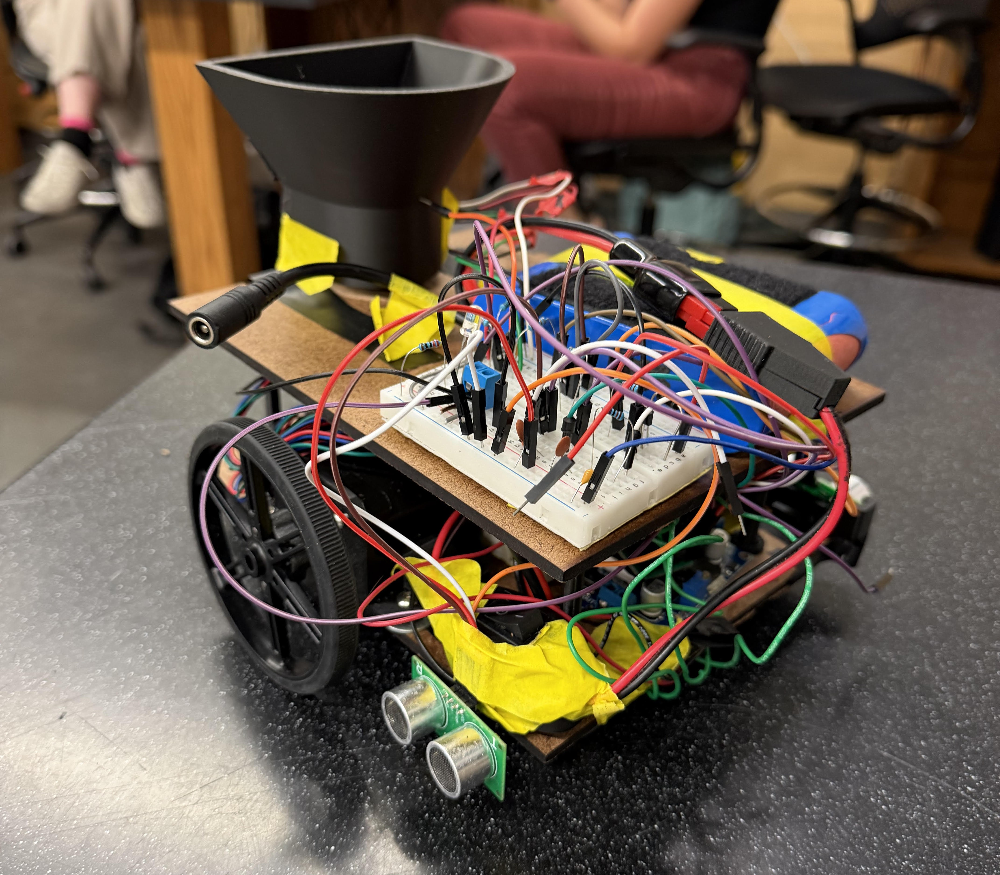
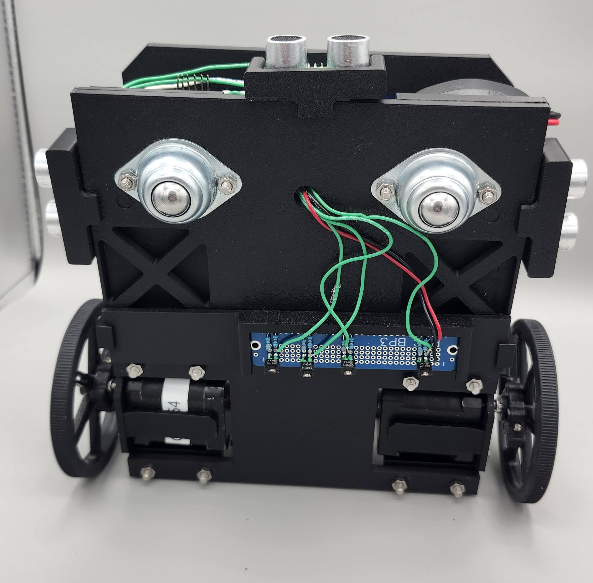
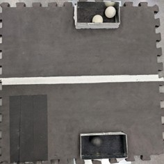

---
title: "Fully Autonomous Mechatronics Rover"
image: scrappy_main_photo_short.jpg
---

## Project Overview
The goal of the rover was to autonomously complete a track that contained 5 different tasks at random locations around the course using. 

::: {style="text-align: center:"}
{fig-align="center" height="200px"}
:::

## Tasks
* **Leave Lander and Line Follow**
    Leave the lander section and begin following the white line. This was done by creating a QRD array that would be able to tell where it was on the white line and adjust to follow it.
    

* **Sample Collection and Return**
    Using an IR sensor, see the sample collection apparatus and back up into, catching the ping pong ball as it falls. Later on when the robot sees the two sample return bins, place it in the one that holds the correct color. This was done by mounting both an IR sensor as well as ultrasonic sesnors to see the various tasks, and then designing a ball catch and drop mechanism.
    
    

* **Canyon Navigation**
    After entering a section that is enclosed by walls and has no lines, autonomously exit the section. We were able to do this by using ultrasonic sensors, and then writing code that when it saw a wall in front of it would then turn left or right based on which ultrasonic sensor was more open. 

* **Data Transmission**
    After entering the lander, successfully locate an IR beam and shine a laser at the board on which the IR beam is mounted. By having a servo that would mark where the IR signal was highest, we would then go to that location and turn on a laser to hit the target reliably.
    

## Course Completion Run

{height="400px"}